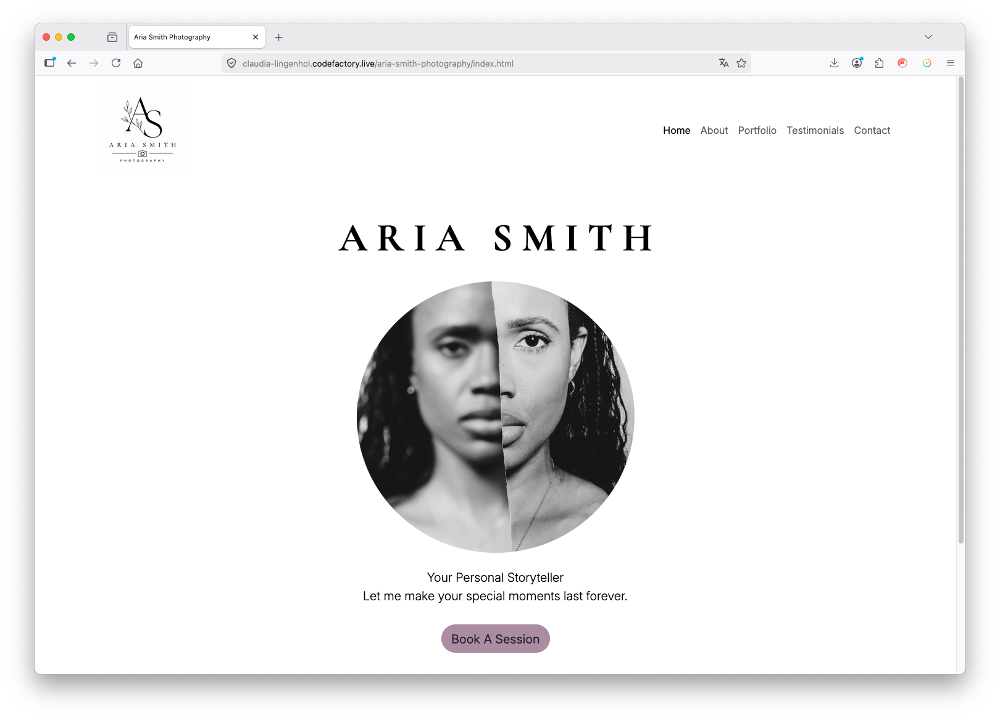
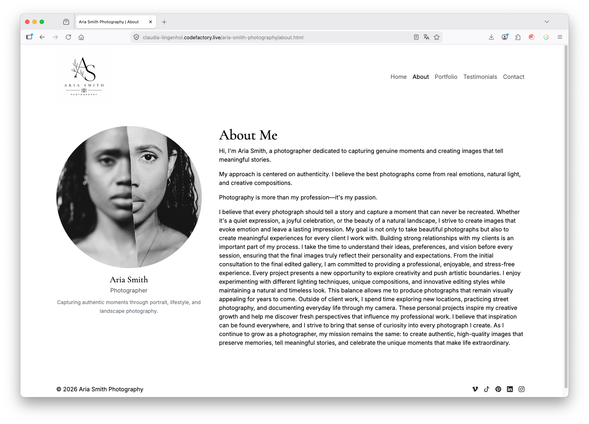
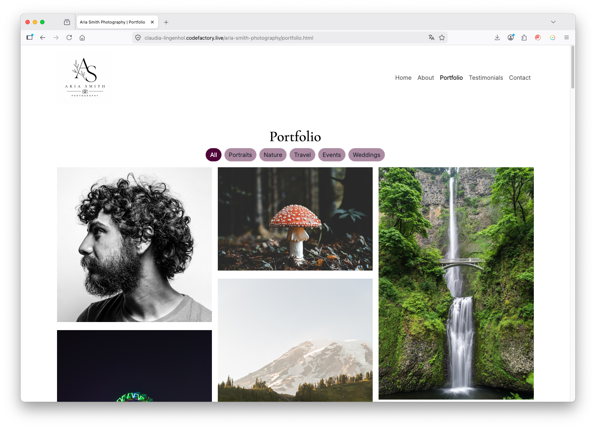
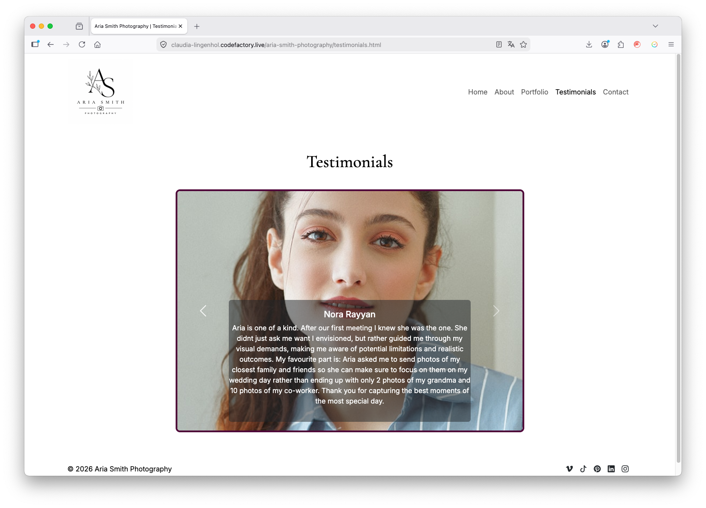
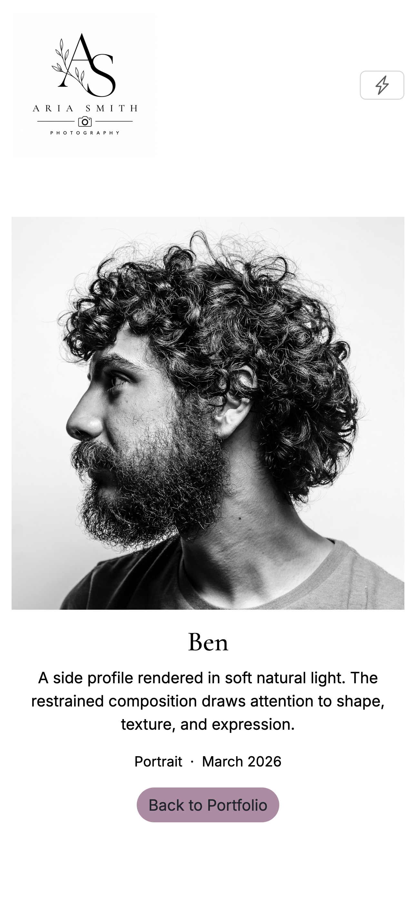
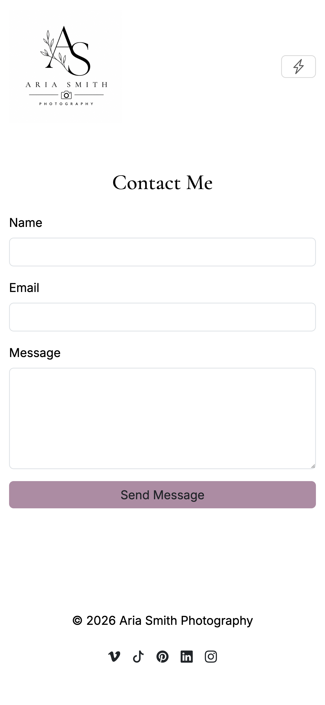

# Aria Smith Photography

A photography portfolio website built with HTML, CSS, JavaScript, and Bootstrap. The project presents a fictional photographer's brand through a responsive multi-page website that includes a filterable portfolio, individual photo pages, an about page, testimonials, and a contact form.



## Project Context

This project was developed collaboratively by a team of three during a Full Stack Web Development course. The goal was to build a multi-page, responsive website using vanilla JavaScript and Bootstrap while applying Git and GitHub workflows in a team environment.

Core concepts practiced:

* Semantic HTML structure
* Responsive design with Bootstrap
* Dynamic DOM rendering with JavaScript
* Data handling with arrays and objects
* Event handling and filtering logic
* Multi-page navigation
* Team collaboration using Git and GitHub

## Features

* Responsive multi-page photography website
* Animated hero section on the homepage
* About page introducing the photographer
* Dynamic portfolio gallery generated from JavaScript data
* Category-based photo filtering
* Individual photo detail pages
* Testimonials page
* Contact form with client-side validation
* Responsive navigation and footer with social media links

## Technologies

* HTML
* CSS
* Bootstrap
* JavaScript
* Git & GitHub

## Screenshots

### About Page



### Portfolio Gallery



### Testimonials Page




### Mobile Layout

<p align="center">


</p>

## Project Structure

```
frontend-group-project/
├── css/
│   └── style.css
├── images/
├── js/
│   ├── main.js 
│   ├── data.js
│   ├── portfolio.js
│   ├── details.js
│   └── contact.js
├── index.html
├── about.html
├── portfolio.html
├── details.html
├── testimonials.html
└── contact.html
```

## Getting Started

Clone the repository and open `index.html` in your browser.

## Team Aria

Developed collaboratively by:

- Ammaarah Samy
- Richard Adebayo
- Claudia Lingenhöl
